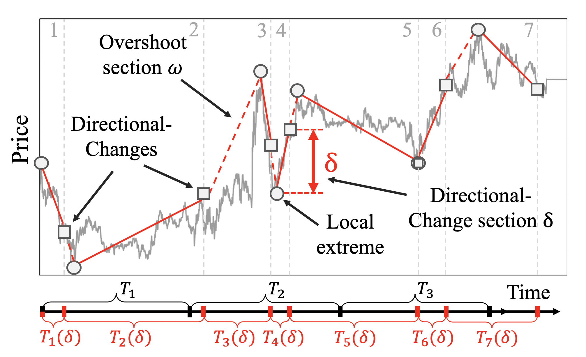
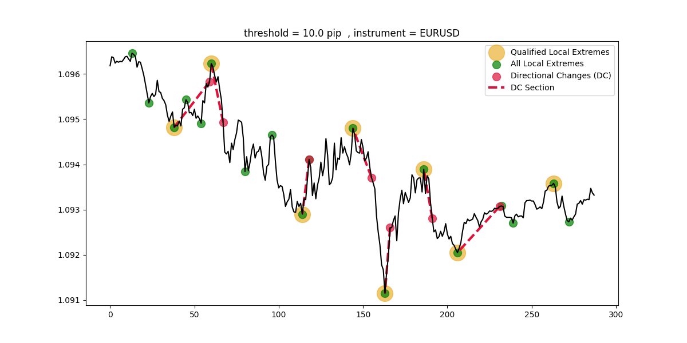
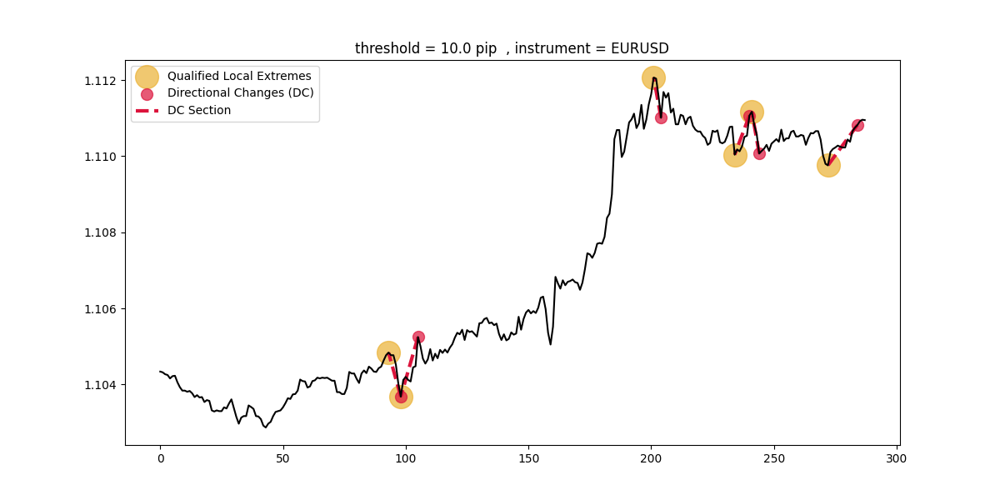

## Directional Changes Detection 
One of the most considerable issues in time series analysis is detection of directional changes . Where the price trends changes 
in climaxes . Many data scientists and traders want to work on the mentioned regions . So we can say that directional changes detector is some sort of market price indicator . 
In this project you can run the code to find directional changes points , sections and climaxes . You can change the parameters for suited for your demand.  
Image below is trying to describe the directional changes and for more information you can check <a href="https://www.mlfinlab.com/en/latest/feature_engineering/directional_change.html#:~:text=Directional%20Change%20(DC)%20is%20a,and%20Overshoot%20(OS)%20Event.">DC explain</a>:

Also You can see the plot of the result in the image below :

